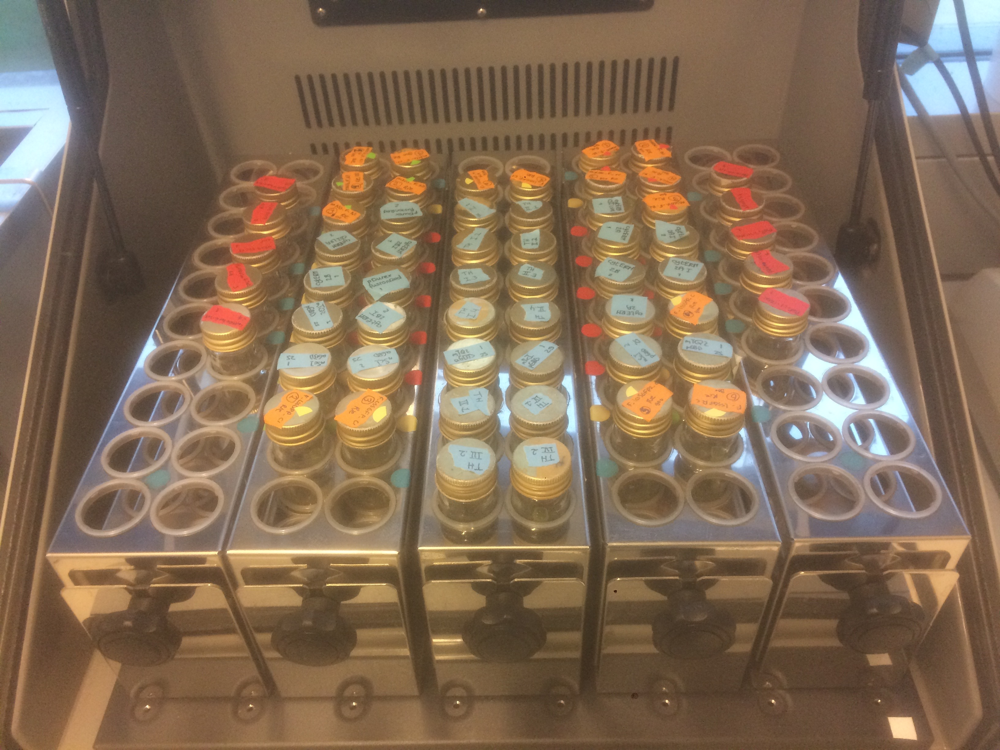
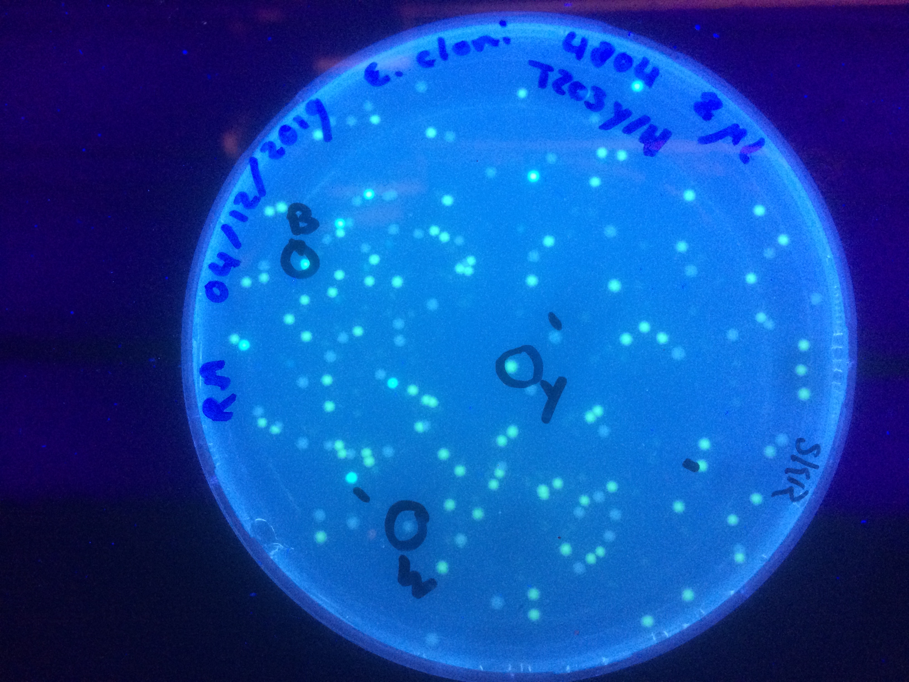

```{=html}
<!-----
The code on this page is based on:
https://b.bapt.xyz/posts/gallery/#generating-the-page-with-quarto
---->
```


## Test

{.lightbox}



```{r,  results='asis', echo=FALSE, warning=FALSE, message=FALSE}

# This code automatically generates the Markdown to load the photos, grouping them according to the folder structure.

# Find the directory names
dirlist <-  list.dirs(path = "photos", full.names = F, recursive = F)

#Go through all the directories
for (i in seq_along(dirlist)) {
  
  #Read all the pcitures in the subdirectory
  filename <- list.files(path=paste0("photos/", dirlist[i]),
                         recursive=F,
                         pattern="*.jpg|*.JPG|*.jpeg|*.JPEG|*.png|*.PNG",
                         full.names=F)
  
  #Genberate a header of the category (same as name of the folder)
  
  cat(paste("#",dirlist[i],"\n\n"))
  
  cat(paste("::: gallery\n\n"))
  
  #Generate the list of photos
  cat(paste0('{.lightbox}\n'))
  
  #Add a white line after each category
  cat(paste0('\n:::\n\n'))
   
}

```

